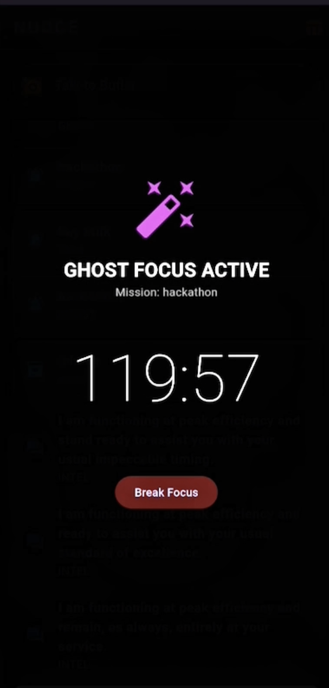
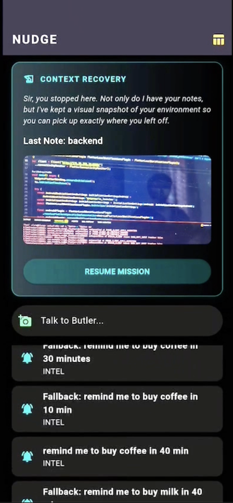

# 🎩 Nudge: The Flutter Butler
> **"Focus is fragile. The Butler protects it."**

<h3>
  <a href="https://my-nudge.serverpod.space/">🚀 Live Demo</a>
   | 
  <a href="https://youtube.com/shorts/-NqXRqagi6U?feature=share">📺 Watch Video</a>
</h3>

---

## 📖 Table of Contents
- [Inspiration](#-inspiration)
- [What it Does](#-what-it-does)
- [The "Wow" Factor](#-the-wow-factor-context-capsule-)
- [Visuals](#-visuals)
- [How We Built It](#-how-we-built-it)
- [Challenges & Learnings](#-challenges--learnings)
- [Installation](#-local-setup--installation)
- [Future Scope](#-whats-next-for-nudge)

---

## 💡 Inspiration

We’ve all been there: you’re deep in a complex coding session, the "flow state" is at its peak, and then—life happens. A phone call, a knock at the door, or a quick coffee break. When you sit back down, the **"activation energy"** required to rebuild that mental map is immense.

I built **nudge** because focus is the most fragile resource we have. I wanted a **"Butler"** that didn't just nag me with lists, but one that could actually archive my mental state and give it back to me when I was ready to resume.

---

## 🤖 What it Does

**Nudge** is a high-performance **Cognitive Partner** designed for engineers and students operating in high-intensity environments. It isn't just another to-do list; it’s a toolkit designed to protect your deep work.

### Key Features
* **🧠 The Butler Brain (Intent Engine):** Powered by **Gemini 1.5 Flash**, Nudge uses advanced NLU (Natural Language Understanding) to distinguish between casual thoughts (**Intel**), deadlines (**Tasks**), warranties (**Asset**), or deep-work sessions (**Ghost Mode**).
* **⚡ Intelligent Task System:** Beyond simple checkboxes, the Butler extracts actionable deadlines from natural language (e.g., *"Remind me to push the code in 2 hours"*). It transforms relative times into precise database timestamps, ensuring you never miss a mission.
* **📦 The Asset Vault:** A secure, relational archive built on **Serverpod's ORM** that tracks physical items and their warranties. The Butler tracks the "expiry" of your physical assets so you don't have to.
* **👻 Ghost Focus Mode:** A specialized UI overlay that "haunts" your device, visually isolating you from digital noise and locking focus on your current mission.

---

## ✨ The "Wow" Factor: Context Capsule 🚀

In modern work, **context switching** is the ultimate productivity killer. When you step away from a complex mission, you lose your mental map.

**NUDGE fixes this.**
This is the flagship **"save-point"** feature. Before you "pause," you snap a photo of your environment paired with a technical note. This creates a visual and logical restore point in the **PostgreSQL** database. When you return, the Butler doesn't just show you a note; it **restores your visual and mental context**, reducing the activation energy needed to restart a task to near zero.

---

## 📸 Visuals

### 📽️ [Click Here to Watch the Demo Video](https://youtube.com/shorts/-NqXRqagi6U?feature=share)

### 📸 Screenshots

| Context Capsule | Asset Vault |
|:--:|:--:|
|  |  |
| *Visual memory restore for your brain* | *Your physical world, archived* |

---

## 🏗️ How We Built It

The architectural backbone of **nudge** is a **"Single-Language Monolith"** approach. By utilizing **Serverpod 3** alongside **Flutter**, I eliminated the "Context Switching" that usually plagues full-stack development.

### 1. The Serverpod Orchestration (The Backbone)
Serverpod acted as the **"Command Center"**:
* **The Protocol Engine:** Core business logic (`Task`, `Asset`, `ContextCapsule`, `NudgeResponse`) was defined using Serverpod's YAML protocol files. The **Automatic Code Generation** created perfectly typed Dart classes and client-side mirrors.
* **ORM & Database:** Utilized Serverpod’s built-in **ORM** to manage a **PostgreSQL** database with strict type safety.
* **Session Management:** Every request is handled via a Serverpod **Session**, allowing for server-side logging and error tracking of the AI's "thought process."

### 2. The Flutter Client (The Interface)
The Flutter application serves as the **"Senses"** of the Butler:
* **Native Integration:** Utilized hardware access to capture high-fidelity images for Context Capsules.
* **State Management:** Built a reactive UI that updates in real-time.
* **Cloud Connectivity:** Used the generated `Client` library to establish a secure link to the **Serverpod Cloud**.

### 3. The AI Integration (The Brain)
* **Server-Side Intent Extraction:** The Flutter app sends raw text to a Serverpod **Endpoint**, which communicates with **Gemini** using engineered prompts to extract structured JSON.
* **The Safety Governor:** A logic layer that parses the AI's response. If the AI identifies a "Task," the server calculates the timestamp; if it's an "Asset," it prepares a database entry.

### 4. Deployment
* **Dockerized Development:** Used Docker to maintain a local PostgreSQL environment mirroring production.
* **Serverpod Cloud:** Deployed using `scloud`, providing a global, SSL-secured API endpoint.

---

## 🧗 Challenges & Learnings

### Challenges we ran into
* **Hardware Hurdles:** Early in the hackathon, I faced significant issues setting up the Android Studio emulator. I pivoted immediately to developing on a **physical Android device**, forcing me to deal with real-world constraints like network latency and camera access from day one.
* **JSON Reliability:** Forcing an LLM to consistently return structured data for the **Intent Engine** required rigorous prompt engineering and a **"Safety Governor"** logic to handle malformed responses.

### Accomplishments we're proud of
* **Pivoting Under Pressure:** Successfully managing the entire development cycle on a physical device.
* **The "Butler" Intelligence:** Implementing a reliable Intent Engine where Gemini consistently returns structured data my backend can act upon.
* **Unified Dart Mastery:** Mastering the **Serverpod 3** ecosystem to build a complete full-stack system where frontend and backend share the same logic.

### What we learned
We learned that "resuming" work is often harder than "doing" it. This inspired our technical formula:
> **Productivity = (Deep Work Time) / (Context Switching Time)**

Maximizing this ratio through **Context Capsules** became our guiding principle.

---

## 🛠️ Local Setup & Installation

### 1. Prerequisites
* **Flutter SDK**
* **Serverpod CLI**: `dart pub global activate serverpod_cli`
* **Docker**: To run the local PostgreSQL database.

### 2. Configure Backend
1.  Navigate to server: `cd nudge_server`
2.  Start Docker containers: `docker-compose up -d`
3.  Add your Gemini API key in `lib/src/logic/parser.dart`.
4.  Run server: `dart bin/main.dart --mode development`

### 3. Configure Client
1.  Navigate to app: `cd nudge_flutter`
2.  Ensure `main.dart` points to `localhost`.
3.  Run app: `flutter run`

---

## ⚖️ Limitations & Technical Honesty
As a hackathon prototype, we prioritize transparency:
* **System Alarm Restrictions:** System-level alarms (Android Alarm Manager) are currently disabled due to OS strictness; notifications are handled in-app.
* **Web Platform:** Push notifications are not currently active on the Web version due to browser permissions.
* **Gemini API:** Utilizes **Gemini Free Tier**, which may hit `429` rate limits if requests are spammed rapidly.
* **Demo Optimization:** To ensure judges see the AI loop without waiting hours, the "Task" and "Asset" logic provides **instant feedback** rather than delayed scheduling.

---

## 🚀 What's Next for NUDGE

* **The "Social Sentry":** Monitoring interaction patterns with your "Inner Circle" and triggering a **"Connection Alarm"** if you've been isolated too long.
* **The Bookmark Librarian:** A **Serverpod Browser Extension** to sync bookmarks and suggest relevant reading during low-activity slots.
* **Hydration Intelligence:** A managed **3-Hour Water Cycle** using Serverpod’s background scheduling to prevent brain fog.
* **Emergency SOS:** Automatically trigger an email to a trusted contact if the Butler detects complete inactivity during a high-stakes mission.
* **Automated Asset OCR:** Implementing **Google ML Kit** to scan physical receipts directly into the **Asset Vault**.
* **Voice-First Interaction:** Implementing **Speech-to-Text** so you can "whisper" a mission to your Butler.

---

Built for the **Serverpod 3 Global Hackathon** 🏆
*Track: Mobile, Productivity, Lifehacks*

